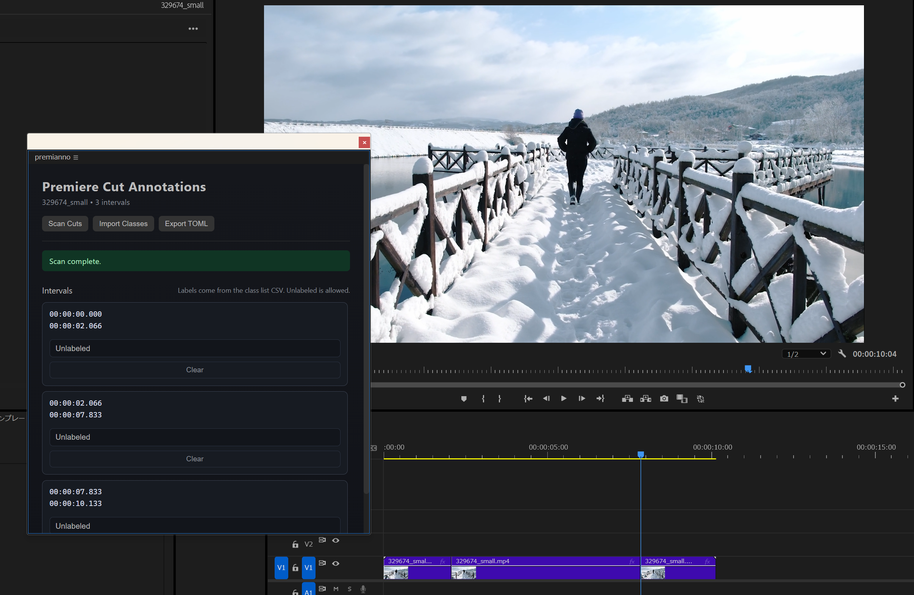

# Premianno

A Premiere Pro UXP Plugin for Dataset Annotation

## Overview

PremiAnno is a UXP-based plugin for Adobe Premiere Pro that enables time-synchronized annotation directly on the timeline.
It is designed for AI research projects and media analysis workflows, allowing researchers and creators to label timeline intervals without leaving the editing environment.

By integrating annotation into Premiere Pro, PremiAnno bridges the gap between creative editing and data collection for machine learning, video understanding, and multimodal AI research.



## Features

- ✂️ Cut-based interval scan — detect interval boundaries from timeline cuts
- 🏷️ CSV class import — import class labels from `index,class` CSV
- 📦 TOML export — export sequence and interval labels as TOML

## Requirements

- Adobe Premiere Pro 25.6 or later (UXP plugins are officially supported from this version)

## Install Premianno

1. Download the latest PremiAnno CCX asset from the [Release Page](https://github.com/rmuraix/premianno/releases)
2. Install [ZXP/UXP Installer](https://aescripts.com/learn/zxp-installer/)
3. Open ZXP/UXP Installer and drag and drop the downloaded CCX file

## Development

### Commands

```bash
# Install dependencies
pnpm i
# Build the plugin
pnpm uxp build
# Build the plugin in watch mode for development
pnpm uxp dev
# Build & package the plugin as CCX
pnpm uxp ccx
# Build & package the plugin as ZIP
pnpm uxp zip
```

## Contributing

Your contribution is always welcome. Please read [Contributing Guide](https://github.com/rmuraix/.github/blob/main/.github/CONTRIBUTING.md).
