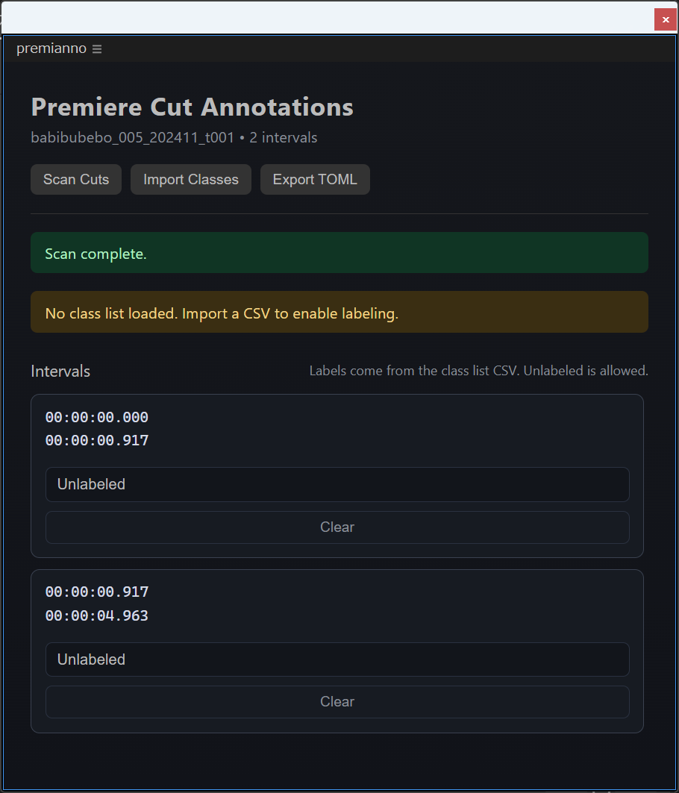

# Getting Started

This guide will help you get started with PremiAnno quickly.

## Prerequisites

Before you begin, ensure you have:

- Adobe Premiere Pro 25.6 or later (UXP plugins are officially supported from this version)

## Quick Start

### 1. Download PremiAnno

Download the latest PremiAnno CCX file from the [Release Page](https://github.com/rmuraix/premianno/releases).

### 2. Install the Plugin

1. Double-click the downloaded `.ccx` file
2. Follow the installation prompts

### 3. Launch PremiAnno

1. Open Adobe Premiere Pro
2. Navigate to **Window > UXP Plugins > PremiAnno**
3. The PremiAnno panel will appear in your workspace

### 4. Start Annotating

1. Click **Scan Cuts** to generate timeline intervals
2. Click **Import Classes** and load a class CSV
3. Assign labels to each interval from the dropdown
4. Click **Export TOML** when ready

## What's Next?

- [Installation Guide](/guide/installation) - Detailed installation instructions
- [Usage Guide](/guide/usage) - Learn all features and capabilities
- [Development Guide](/guide/development) - Set up a development environment

## Need Help?

If you encounter any issues:

- Check the [GitHub Issues](https://github.com/rmuraix/premianno/issues)
- Read the detailed guides in this documentation
- Contribute to the project on [GitHub](https://github.com/rmuraix/premianno)
